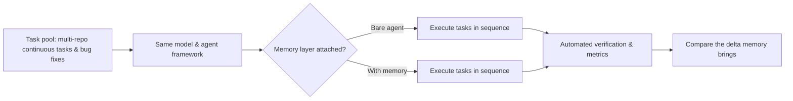

Today we're releasing [MemoryBench](https://niceeval.com/showcase/memory): a benchmark for evaluating how memory products perform on real coding tasks.

Over the past two years, single-shot model capabilities have been measured to death: Q&A, code generation, single-file edits — leaderboards stacked wall to wall. But what actually pushes agents into production is a different question: when a task spans multiple repositories and runs for hours, does the agent still remember what it did, what it looked up, and why it made each decision?

That's the question MemoryBench answers. Same model, same tasks, one variable: whether a memory layer is attached. We quantify how much the memory mechanism actually helps across continuous, real-world development tasks.

## Why agent memory matters
[Rent the Intelligence. Own the Memory. A Manifesto](https://x.com/wey_gu/article/2083118261601005612)

Intelligence is rented; memory is owned. But which memory products actually help an agent remember things and perform better on continuous work?

Look at what's happening. Agent usage is shifting fast: from single-turn Q&A and single-file completion to cross-repo investigation, fixing bugs in sequence, and running multi-hour, multi-step engineering tasks. At that scale, no context window can hold the full history — the agent has to store information and retrieve it later.

That makes the memory layer a critical component of long-horizon work. Memory products like mem0, Zep, Letta, and MemGPT have exploded over the past year, each pitching its own storage strategy, compression algorithm, and retrieval scheme. The problem: these designs all look great in demos, but once hooked up to a real agent facing real tasks, which ones actually work?

That's the missing piece today: products are iterating fast, but evaluation has stayed stuck.

## What MemoryBench is

MemoryBench is built for exactly that. Its core setup is one rule: same model, same agent framework, same sequence of continuous tasks, with the only variable being whether a memory layer is attached.

The tasks aren't single-turn. The agent works across multiple repositories, solving real development tasks and fixing real bugs, in a process that spans many steps and many codebases. Under this setup we compare a bare agent against one with a memory layer, and measure the delta the memory mechanism actually brings.

Short-task benchmarks ask "can it do the job?" MemoryBench asks "does memory make continuous work better?" It shares a lineage with Terminal-Bench Challenges: both are long-horizon, token-intensive evaluations that run in real environments — except MemoryBench treats the memory layer itself as the variable under test.

## How we measure: task design and metrics
[Evolving Memory Systems - An Eval-First Approach](https://linghao.io/posts/memory-systems-should-be-evolved)

The task pool is made of real development tasks: multi-repo continuous tasks, bug fixes, and implementing features from issues. Every task has to run through to verification in a real environment; agent output is checked automatically, not graded by human eyes.

Controlled variables are the core of the design. The model is fixed, the agent framework is fixed, the task order is fixed. The memory layer is the variable under comparison. Interpreting the results also requires repeated runs, task-level comparisons, and attention to resource budgets to establish whether differences are consistent.

We focus on three metrics: task completion rate, whether tasks get finished; first-pass success rate, how often a task is done right the first time; and bugs fixed, how many get resolved per unit of time. This post describes the evaluation design and questions to investigate; it does not report completion-rate gains or product rankings.

## Questions to investigate

Does memory improve task completion? We want to compare results by task type, including cross-repo work that requires revisiting earlier information and single-file tasks.

Does memory add execution time? Retrieval costs, irrelevant information, and stale records need to be examined alongside task completion.

Does recall accuracy predict task performance? Connecting retrieval results to task outcomes can help establish whether remembered information actually helped the agent.

These are questions for the benchmark to answer. Any reported conclusion should include the task-set version, model and run configuration, sample size, and inspectable run records.

## How to participate

We welcome any memory solution to come and be tested. Submit via PR.

The leaderboard will keep evolving. As the task pool grows, historical results may re-rank as the task set changes; comparisons need matching task-set versions and run configurations. Logs help inspect execution, but do not by themselves guarantee reproducibility.

We look forward to seeing more memory products and more integration approaches on the board. Memory is the next bottleneck for long-horizon agent work — let's measure it properly together.
