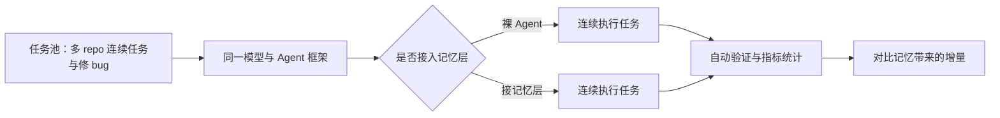

今天，我们发布 [MemoryBench](https://niceeval.com/showcase/memory)：一套在真实编程任务中评估记忆产品表现的基准。

过去两年，模型本身的单次能力已经被测得很透：问答、代码生成、单文件修改，各种 leaderboard 排得密密麻麻。但真正把 Agent 推向生产环境的，是另一个问题：当任务横跨多个仓库、持续数小时，Agent 还记不记得自己做过什么、查过什么、为什么这么做？

MemoryBench 想回答的就是这个问题。它用同一模型、同一任务，唯一变量是"接不接记忆层"，在连续的真实开发任务里量化记忆机制到底起了多少作用。

## 为什么 Agent 记忆很重要
[Rent the Intelligence. Own the Memory. A Manifesto](https://x.com/wey_gu/article/2083118261601005612)

智力是租来的，而记忆是自己的。但是到底哪家 Memory 真的能帮 Agent 记住东西、在连续任务中发挥作用？

先看发生了什么。Agent 的用法正在快速变化：从单次问答、单文件补全，走向跨仓库调研、连续修 bug、跑完一个数小时的多步骤工程任务。在这个尺度上，上下文窗口再怎么扩容也装不下全部历史，Agent 必须把信息存下来、再取回来。

于是记忆层成为长时程工作的关键组件。mem0、Zep、Letta、MemGPT 等 memory 产品在过去一年集中爆发，各家都在讲自己的存取策略、压缩算法、检索方案。问题是：这些设计在演示里都很好看，可一旦接上真实 Agent、面对真实任务，到底谁真的有用？

这正是当前最缺的一环：产品在快速迭代，评测却停在原地。

## MemoryBench 是什么

MemoryBench 就是为这个问题设计的。它的核心设定只有一条：同一模型、同一 Agent 框架、同一组连续任务，唯一变量是是否接入记忆层。

任务不是单轮的。Agent 要在多个 repo 之间连续解决真实的开发任务、修复真实的 bug，整个过程持续多个步骤、跨越多份代码。在这个设定下，我们对比裸 Agent 和接了记忆层的 Agent，看记忆机制到底带来了多少增量。

短任务 benchmark 回答的是"能不能做"，MemoryBench 回答的是"记忆让连续任务做得更好吗？"它和 Terminal-Bench Challenges 同源：都是长时程、token 密集、跑在真实环境里的评测，只是 MemoryBench 把"记忆层"作为被考察的变量。

## 怎么测：任务设计与指标
[Evolving Memory Systems - An Eval-First Approach](https://linghao.io/posts/memory-systems-should-be-evolved)

任务池由真实的开发任务构成：多 repo 连续任务、修 bug、按 issue 实现功能。每个任务都要在真实环境里跑通验证，Agent 的产出会被自动化检查，而不是靠人眼打分。

控制变量是整套设计的核心。模型固定、Agent 框架固定、任务顺序固定，唯一变化的是记忆层。比较结果时，还需要结合重复运行、任务差异和资源预算，判断观察到的差异是否稳定。

指标上我们关注三件事：任务完成率，看能不能跑完；一次通过率，看第一遍就做对的比例；修复 bug 数，看单位时间内修掉多少。本文介绍评测设计与待验证的问题，不报告完成率提升或产品排名结论。

## 希望验证的问题

记忆是否改善任务完成率？我们希望按任务类型比较结果，观察跨仓库、需要回看历史信息的任务，与单文件任务是否存在差异。

记忆是否增加了额外耗时？需要检查检索成本、无关信息和过时记录是否影响执行，再与任务完成情况一起比较。

回忆准确率能否预测实际任务表现？需要把记忆检索的表现与任务结果关联起来，才能判断记住的信息是否真正帮助了 Agent。

这些是评测要回答的问题。报告结论时，应同时提供任务集版本、模型与运行配置、样本数量，以及可核对的运行记录。

## 如何参与

我们欢迎各种 memory 方案来接受检验。直接通过 PR 来提交。

Leaderboard 会持续更新。随着任务池扩充，历史成绩也可能因任务集变化而重新排序，比较成绩时需要对齐任务集版本与运行配置；日志用于核对执行过程，不能单独保证结果可复现。

期待看到更多 memory 产品、更多接入思路出现在榜上。记忆是 Agent 长时程工作的下一个瓶颈，我们一起把它测清楚。
