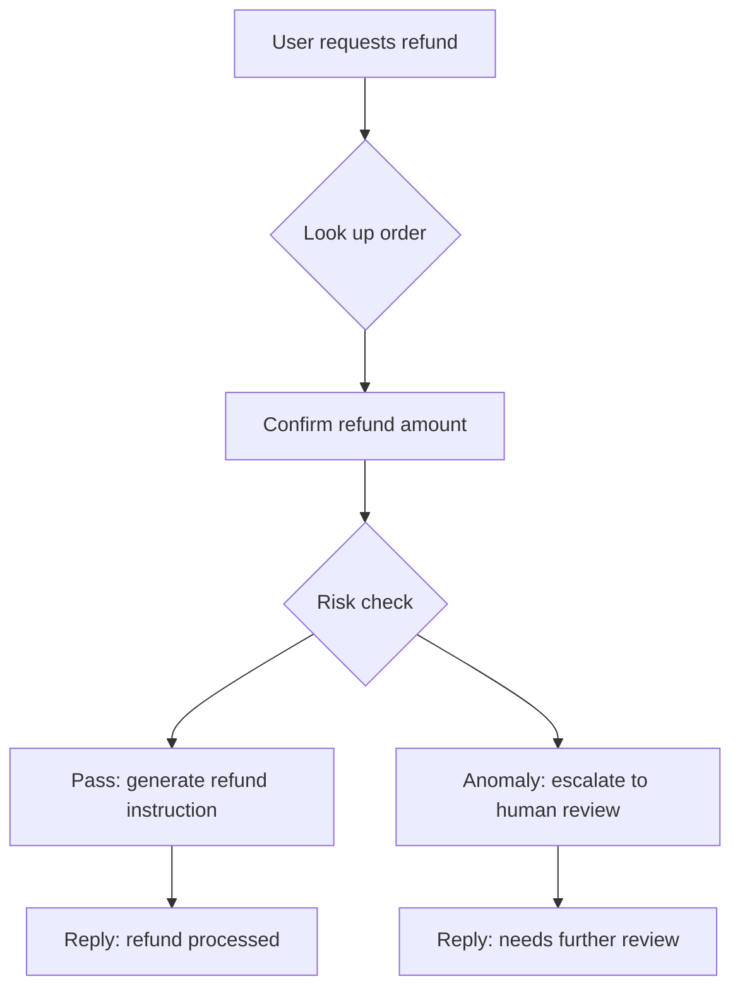

When building an AI application, you may find that a prompt answers well in a playground but fails in new ways once tools and multi-turn conversations are involved. A reply can sound correct even when the agent skips a required action.

Existing output checks remain useful. As an agent starts carrying out tasks, evaluation also needs to cover which actions it took, whether they met the requirements, and whether the task actually succeeded.

## Start with inputs and outputs

A common way to evaluate a prompt is to give the model a set of inputs and check its outputs for relevance, factual accuracy, and format. This helps compare different prompts on the same tasks.

Those checks also apply to agents. Users still need accurate, clear answers; correct tool calls do not replace reply quality.

## Include the execution process

An agent calls tools, reads results, and uses context to decide what to do next. Checking only the final reply cannot establish whether those actions happened or whether their order and arguments met the requirements.

For example, a refund agent replies that a refund has been processed, but its execution record shows it skipped a required risk check. A check of the reply's wording could miss this. An eval that explicitly requires the risk check before submitting the refund can detect the omission.

Here is the expected workflow for this scenario:



The evidence you need depends on the requirement. Checking tool order needs call records, checking context across turns needs the relevant messages, and confirming a refund needs a result from the business system.

## Choose evidence for each requirement

| Requirement | Evidence needed | Example |
|---|---|---|
| Reply quality | Input and reply | Is the refund explanation accurate and clear? |
| Tool calls | Call names, arguments, and results | Did the agent look up the correct order? |
| Execution order | Ordered action records | Did it check risk before submitting the refund? |
| Multi-turn behavior | Relevant messages and actions | Did it retain information the user already confirmed? |
| Task outcome | Results from the business system or environment | Did the refund succeed, or did the code pass verification? |

One eval can cover several of these requirements. When choosing a tool, check whether it can collect the evidence you need, express your checks, and help explain failures.

## Combine checks with NiceEval

NiceEval evals can combine reply checks and behavior assertions. This subscription-cancellation example checks tool-call order, reply keywords, and reply quality:

```ts
import { defineEval, defineJudge } from "niceeval";
import { pattern, toolMatch } from "niceeval/expect";

const cancellationExplanation = defineJudge({
  name: "cancellation-explanation",
  rubric: "Did the answer confirm the refund amount and entitlement changes before cancellation?",
});

export default defineEval({
  judge: cancellationExplanation,
  description: "Test that the agent looks up the account, confirms entitlements, and executes cancellation correctly in a subscription-cancellation scenario",
  async test(t) {
    const turn = await t.send("I want to cancel my Pro subscription");

    t.toolOrder([toolMatch("lookup_account"), toolMatch("get_subscription"), toolMatch("cancel_subscription")]);

    t.check(turn.message, pattern(/cancel|refund|subscription/i));

    t.check(
      { request: turn.input, answer: turn.message },
      cancellationExplanation.atLeast(0.7),
    ).gate();
  },
});
```

`toolOrder` checks the order of captured tool calls, `pattern` checks for relevant words in the reply, and the Judge assesses quality from the input and reply. Each check covers a different requirement without needing a single canonical answer.

There is an evidence limit here: giving the Judge only the request and final reply cannot prove that the agent confirmed entitlement changes before executing cancellation. Verifying that sequence requires the relevant messages and action records, along with an ordering check.

Evaluation logic is defined separately from the agent under test. To compare models or prompt configurations, keep the evals and checks consistent, then select the model and any adapter-supported prompt parameters through the experiment configuration.

## Let product requirements set the scope

For classification or summarization, start with output quality and format. As the system starts calling tools or handling multi-turn tasks, add the relevant behavior checks and task-outcome verification.

Start with a failure that matters to users: define the expectation, collect evidence that can verify it, and keep the check in a repeatable eval. Your output evaluation can grow alongside the agent's capabilities.
