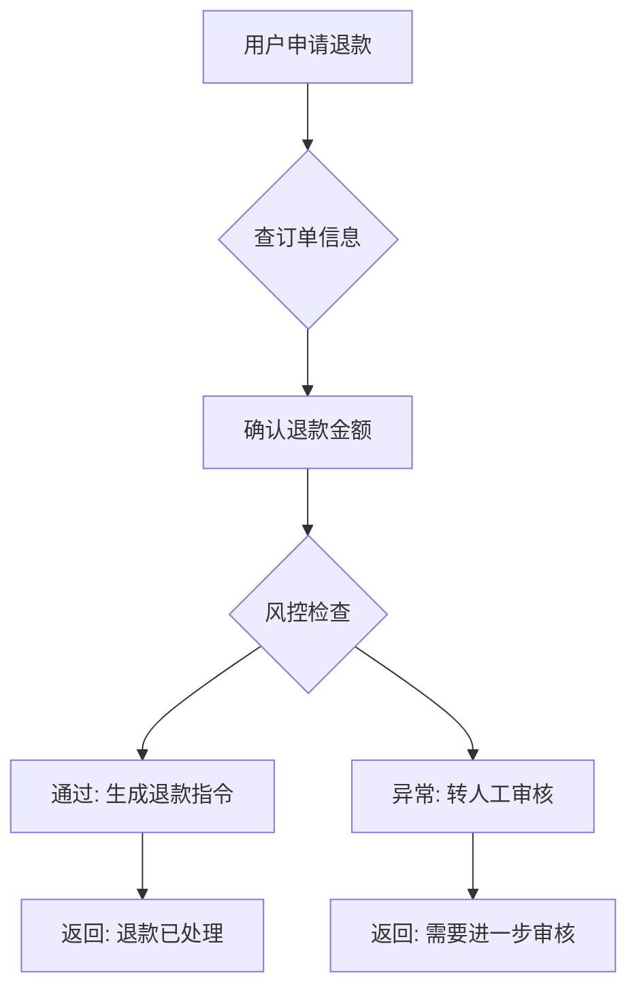

如果你正在构建 AI 应用，可能遇到过这样的情况：提示词在 playground 里回答得很好，接上工具、开始多轮对话后，却出现了新的失败方式。回复听起来正确，实际操作却可能遗漏一步。

原有的输出检查仍然有用。随着 Agent 开始执行任务，评估还需要覆盖它采取了什么动作、动作是否符合要求，以及任务是否真正完成。

## 从输入与输出开始

评估提示词的一种常见方式，是给模型一组输入，再检查输出的相关性、事实准确性和格式。这能帮助你比较不同提示词在同一组任务上的表现。

这些检查同样适用于 Agent。用户仍然需要准确、清楚的回答，工具调用正确也不能替代回复质量。

## 把执行过程纳入评估

Agent 会调用工具、读取结果，并根据上下文决定下一步。仅检查最终回复，无法确认这些操作是否实际发生，也无法确认它们的顺序和参数是否符合要求。

例如，一个退款 Agent 回复了“退款已处理”，但执行记录显示它跳过了规定的风控检查。只检查回复措辞可能漏掉这个问题；如果用例明确要求先完成风控检查，再提交退款，就能针对这个遗漏作出判定。

下面是这个场景期望的处理流程：



需要收集哪些证据，取决于用例要检查什么。检查工具顺序需要调用记录，检查多轮上下文需要相关消息，确认退款到账则需要业务系统的结果。

## 按检查目标选择证据

| 检查目标 | 所需证据 | 示例 |
|---|---|---|
| 回复质量 | 输入与回复 | 退款说明是否准确、清楚 |
| 工具调用 | 调用名称、参数与结果 | 是否查询了正确的订单 |
| 执行顺序 | 有顺序的操作记录 | 是否先检查风险，再提交退款 |
| 多轮行为 | 相关轮次的消息与操作 | 是否沿用了用户已经确认的信息 |
| 任务结果 | 业务系统或环境中的结果 | 退款是否成功，代码是否通过验证 |

这些目标可以放在同一个评估用例中。选择工具时，应核对它能否接入所需证据、表达检查条件，并帮助你定位失败原因。

## 用 NiceEval 组合检查

NiceEval 的评估用例可以组合回复检查与行为断言。下面的取消订阅示例同时检查工具调用顺序、回复关键词和回复质量：

```ts
import { defineEval, defineJudge } from "niceeval";
import { pattern, toolMatch } from "niceeval/expect";

const cancellationExplanation = defineJudge({
  name: "cancellation-explanation",
  rubric: "回答是否在执行取消前确认退款金额和权益变更？",
});

export default defineEval({
  judge: cancellationExplanation,
  description: "测试 agent 在取消订阅场景中正确查询账户、确认权益、执行取消",
  async test(t) {
    const turn = await t.send("我想取消我的 Pro 订阅");

    turn.toolOrder([toolMatch("lookup_account"), toolMatch("get_subscription"), toolMatch("cancel_subscription")]);

    t.check(turn.message, pattern(/取消|退款|订阅/));

    t.check(
      { request: turn.input, answer: turn.message },
      cancellationExplanation.atLeast(0.7),
    ).gate();
  },
});
```

`toolOrder` 检查已采集的工具调用顺序；`pattern` 检查回复是否包含相关词；Judge 根据输入与回复进行质量判断。这些检查覆盖不同要求，不必预先写出唯一的标准答案。

这里也有证据边界：只把请求与最终回复交给 Judge，不能证明 Agent 在执行取消操作之前已经确认权益变更。要验证这个时序，需要提供相关消息与操作记录，并增加对应的顺序检查。

评估逻辑与被测 Agent 分开定义。比较模型或提示词配置时，保持用例与检查条件一致，再通过实验配置选择模型，以及适配器支持的提示词参数。

## 从产品要求决定评估范围

对于文本分类或摘要任务，可以先检查输出质量和格式。随着系统开始调用工具或处理多轮任务，再加入对应的行为检查和任务结果验证。

从最可能影响用户的一种失败开始：写清预期，收集能验证它的证据，再把检查留在可重复运行的用例中。这样，已有的输出评估可以随着 Agent 的能力一起扩展。
